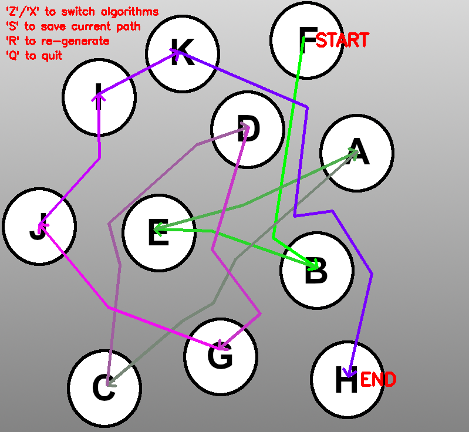
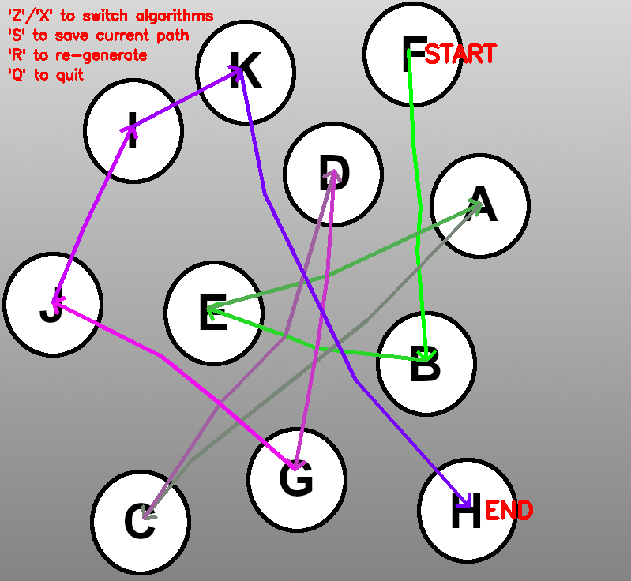

= Random Path Generator

This is a personal project that was initially started to automate the creation of permutations for my cell group for prayer purposes. I then decided to repurpose it into a generic path generator and also experiment with different ways to connect nodes in a graph to look more like a smooth curve.
A visual representation of the generated path can be shown by providing an image along with an input file that will dictate the possible paths that can be drawn on the image.

Currently, the generator has 2 main methods to draw the paths between each member.

 . A *greedy* node selector that uses Euclidean distance heuristic that is *not* guaranteed to return a path. It does not use the *same* node twice for drawing so that no lines overlap completely with each other.
 . *Dijkstra's algorithm* from each member to the next. Users can toggle between allowing usage of the *same* node twice, to show and compare between the different output.

=== Sample Result
* Path with *Greedy algorithm*:
+
ifdef::env-github[]

endif::[]

* Path with *Dijkstra's algorithm*:
+
ifdef::env-github[]

endif::[]

* Path with *Dijkstra's algorithm* where nodes can be used *more* than once:
+ 
ifdef::env-github[]

endif::[]

==== Controls

* Type `Z` and `X` to cycle through the pathfinding methods
* Type `R` to generate a new path
* Type `S` to save the current path (to prevent future path generation to repeat any pairs)
* Type `Q` to quit

=== Features
* Visual representation of the generated path 
_(sample input for 11 members is provided)_
* Path can be saved to prevent any repetition of *pairs* in future path generation
** Etc. If A -> B -> C was saved previously, A -> B and B -> C will not repeat
* Arrows on the image gradually changes color so that it is easy to follow the path
* Different pathfinding methods in drawing lines between the members

=== Inputs:
* Text file with list of members (`sample_input2.txt`)
** Intermediate nodes and all nodes' pixel locations followed by the adjacency list of each node (only required if visualization is desired) (`sample_input.txt` *instead* of `sample_input2.txt`)
* Image with members represented (only required if visualization is desired) (`sample_img.png`)
* Total number of members (only required if visualization is desired) (Edited in `random_path_generator.py`)

Sample input files are included. Their filepaths can be edited in `random_path_generator.py`.

_Nodes in the graph comprise of each member *AND* intermediate nodes that will form the paths between each member_

=== Syntax of text file input *with* input image:
[source,python]
----
# Example in sample_input.txt
# Each node's pixel location
# Start with members, then intermediate nodes
[MemberName]:[PixelX],[PixelY]
[MemberName2]:[PixelX],[PixelY]
[NodeNumber]:[PixelX],[PixelY]
[NodeNumber2]:[PixelX],[PixelY]

# Leave one line empty, then the adjacency list
[NodeNumber]:[ConnectedNodeNumber],[ConnectedNodeNumber2]
[NodeNumber2]:[ConnectedNodeNumber],[ConnectedNodeNumber2]
----

_Lines starting with "#" are treated as comments and are ignored._

=== Syntax of text file input *without* input image:
[source,python]
----
# Example in sample_input2.txt
# List of members separated by commas
[MemberName],[MemberName2],[MemberName3],[MemberName4]
----

_Only the first uncommented line is read, following lines are ignored._

_Lines starting with "#" are treated as comments and are ignored._

=== Required packages:
* Numpy
* OpenCV

