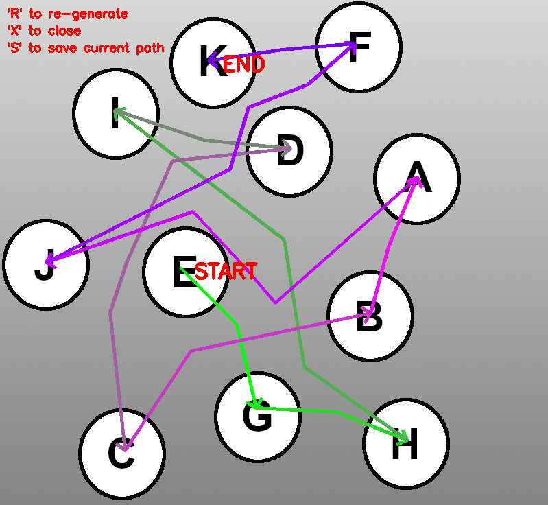

= Random Path Generator

This is a personal project that was initially started to automate the creation of permutations for my cell group for prayer purposes. I then decided to repurpose it into a generic path generator and also experiment with different ways to connect nodes in a graph to look more like a smooth curve.

Currently, the generator uses a greedy node selector that does not always return an optimal path.

=== Inputs:
* Image with members represented
* Text file with list of nodes and their respective pixel locations followed by the adjacency list of each node
* Total number of members

Sample input files are included.

_Nodes in the graph comprise of each member AND intermediate nodes that will form the paths between each member_

=== Syntax of text file input :
[source,python]
----
# Each node's pixel location
# Start with members, then intermediate nodes
[MemberName]:[PixelX],[PixelY]
[MemberName2]:[PixelX],[PixelY]
[NodeNumber]:[PixelX],[PixelY]
[NodeNumber2]:[PixelX],[PixelY]

# Leave one line empty, then the adjacency list
[NodeNumber]:[ConnectedNodeNumber],[ConnectedNodeNumber2]
[NodeNumber2]:[ConnectedNodeNumber],[ConnectedNodeNumber2]
----

_Lines starting with "#" are treated as comments and are ignored._

=== Sample Results
ifdef::env-github[]

endif::[]

=== Required packages:
* Numpy
* OpenCV

